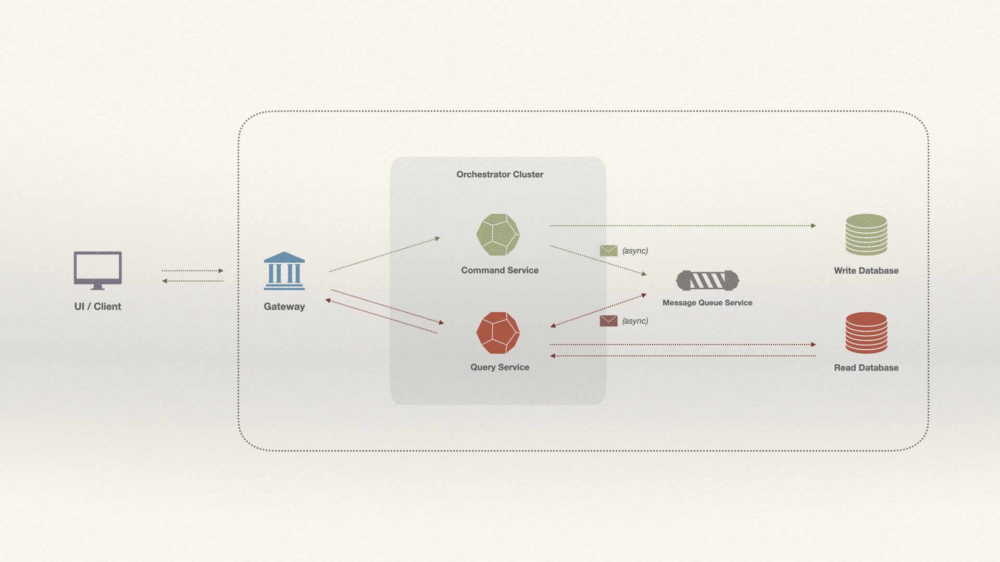

## CQRS POC (Command Service)

A Spring Boot POC using (and exploring) **CQRS** design/architectural pattern (Query approach).

### About

This project explores the use of the **CQRS** (Command Query Responsibility Segregation) pattern in an Order context.

The idea, as directed by the pattern, is to segregate responsibilities. Below is an explanation of the two services implemented for this POC:

#### Tech design:

#### cqrs-command-service (this repo): 
> This service writes (Command) to the database (Write databse). 
>
> For each Order received - and added to the Write database - an event is produced in an Apache Kafka topic. 

#### cqrs-query-service:
> This service is used for reading (Query). 
>
> In addition to exposing GET endpoints, it also consumes messages from an Apache Kafka topic, to save requests to its database (Read database).

### Reference Documentation

* [Command Query Responsibility Segregation by Martin Fowler](https://martinfowler.com/bliki/CQRS.html)
* [Apache Kafka](https://kafka.apache.org/)
* [Spring for Apache Kafka](https://docs.spring.io/spring-boot/docs/3.2.5/reference/htmlsingle/index.html#messaging.kafka)
* [Spring Web](https://docs.spring.io/spring-boot/docs/3.2.5/reference/htmlsingle/index.html#web)